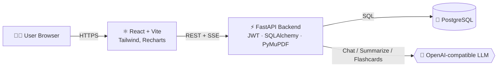

<div align="center">

# 📚 AI Study Companion

### Study smarter, not longer.

Your personal AI tutor — chat with your notes, auto-generate flashcards from PDFs,
track progress, and keep your streak alive. Open source, self-hostable, and free.


</div>

---

## ✨ Features

- 💬 **Chat with your notes** — grounded Q&A over your own study material, with **streaming responses** so answers appear as they're written.
- 🎴 **AI-generated flashcards** — turn any note into a deck of conceptual Q&A cards in one click, with Anki-style review ratings.
- 📝 **PDF → study guide** — upload a PDF and get the extracted text, plus a one-click AI-generated structured summary.
- 🎯 **Progress & recommendations** — track topics, get weakest-first study suggestions.
- 🔥 **Streaks + stats** — daily activity logging, current & longest streaks, total study time.
- 🌙 **Dark mode**, 🔍 **note search**, 🔐 **JWT auth**, 📱 **responsive UI**.
- 🧪 **Tests** (pytest) + 🤖 **CI** (GitHub Actions) + 🌱 **seed script** for instant demo.
- 🐳 **One-command Docker Compose** for Postgres + backend + frontend.

## 🧭 Architecture



## 🚀 Quickstart

### 🐳 Docker Compose (recommended)

```bash
git clone https://github.com/<you>/ai-study-companion.git
cd ai-study-companion
echo "OPENAI_API_KEY=sk-..." > .env      # optional — app falls back to offline stubs
docker-compose up --build
```

- Frontend → <http://localhost:5173>
- Backend docs → <http://localhost:8000/docs>

### 🧪 Try the demo account instantly

```bash
docker-compose exec backend python scripts/seed.py
# then login:
#   email:    demo@aisc.dev
#   password: demodemo
```

### 🛠️ Local dev

```bash
# Backend
cd backend
python -m venv venv && source venv/bin/activate
pip install -r requirements.txt
cp .env .env.local   # edit as needed
uvicorn app.main:app --reload

# Frontend
cd frontend
npm install
npm run dev
```

## 📁 Project structure

```
ai-study-companion/
├── frontend/              # React + Vite + Tailwind
│   └── src/
│       ├── components/    # Navbar, Sidebar, ChatBox, FlashcardStudy, StreakCard, …
│       ├── pages/         # Dashboard, Chat, Notes, Flashcards, Planner, Profile, Landing
│       ├── context/       # AuthContext, ThemeContext
│       ├── hooks/         # useAuth, useTheme
│       ├── services/api.js
│       └── utils/formatDate.js
│
├── backend/               # FastAPI
│   ├── app/
│   │   ├── api/           # auth, chat, notes, progress, flashcards, activity
│   │   ├── core/          # config
│   │   ├── db/            # SQLAlchemy engine + session
│   │   ├── models/        # user, notes, progress, flashcard, activity
│   │   ├── schemas/       # Pydantic request/response models
│   │   ├── services/      # ai_service, pdf_service, flashcard_service, recommendation
│   │   └── utils/         # JWT + password hashing
│   ├── tests/             # pytest — auth, notes, flashcards
│   └── scripts/seed.py
│
├── database/init.sql
├── docs/screenshots/
├── .github/workflows/ci.yml
├── docker-compose.yml
├── Makefile
└── README.md
```

## 🧠 API highlights

| Method | Endpoint                          | Description                                    |
| ------ | --------------------------------- | ---------------------------------------------- |
| POST   | `/auth/register` · `/auth/login`  | Create account / obtain JWT                    |
| GET    | `/notes?q=...`                    | List / search notes                            |
| POST   | `/notes/upload`                   | Upload a PDF — extracts text to a note         |
| POST   | `/notes/{id}/summarize`           | ✨ AI-generated study guide                     |
| POST   | `/chat`                           | Non-streaming chat completion                  |
| POST   | `/chat/stream`                    | ⚡ Streaming chat response (plain text body)   |
| POST   | `/flashcards/generate`            | 🎴 Generate a deck from a note using the LLM   |
| POST   | `/flashcards/cards/{id}/review`   | Rate a card: `again` · `good` · `easy`         |
| GET    | `/progress/recommendations`       | Weakest-first topic suggestions                |
| POST   | `/activity/log` · `/summary`      | Log a study session · streak + totals          |

Full interactive docs at **`/docs`** (Swagger UI).

## 🧪 Running tests

```bash
cd backend
pip install -r requirements.txt
pytest
```

Tests spin up an isolated SQLite DB and force the AI service into offline-stub mode,
so **no API key is required** to run the suite.

## 🔧 Make targets

```bash
make install     # install backend + frontend deps
make dev         # run both dev servers concurrently
make test        # run backend tests
make seed        # populate demo user
make fmt         # run pre-commit formatters
```

## 🔐 Environment variables

| Variable            | Default                          | Notes                                           |
| ------------------- | -------------------------------- | ----------------------------------------------- |
| `DATABASE_URL`      | `sqlite:///./aisc.db`            | Use a `postgresql+psycopg2://` URL in prod      |
| `SECRET_KEY`        | `change-me`                      | **Must** be a strong random string in prod      |
| `OPENAI_API_KEY`    | *(empty)*                        | Leave empty to use offline stubs                |
| `OPENAI_MODEL`      | `gpt-4o-mini`                    | Any OpenAI-compatible chat model                |
| `CORS_ORIGINS`      | `http://localhost:5173`          | Comma-separated list                            |
| `VITE_API_URL`      | `http://localhost:8000`          | Frontend → backend URL                          |

## 📸 Screenshots

> Drop your screenshots in `docs/screenshots/` and they'll show up here.

| Dashboard | Chat | Flashcards |


## 🤝 Contributing

PRs and issues welcome! See [CONTRIBUTING.md](./CONTRIBUTING.md).

## 📜 License

[MIT](./LICENSE) — do whatever you want, just keep the copyright notice.

---

<div align="center">
Made with ☕, ⚡, and a lot of late-night studying.
</div>
